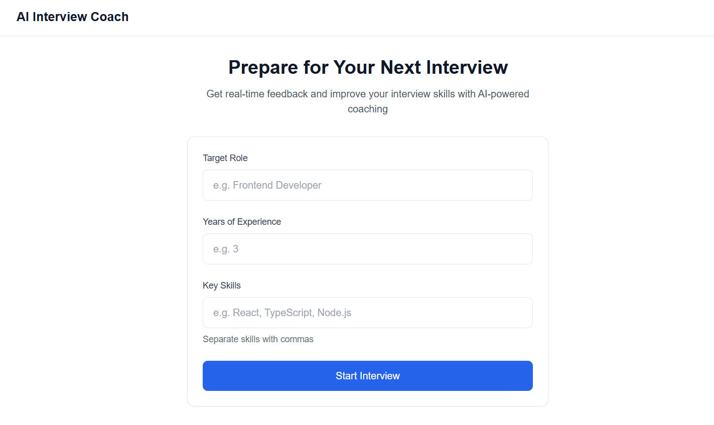
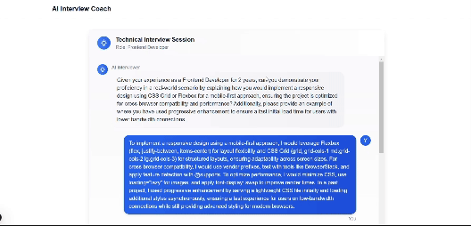

# AI Interview Coach

An intelligent interview preparation tool that conducts mock interviews, provides real-time feedback, and helps improve your interview skills using AI.




## 🌟 Features

- **Intelligent Questioning**: Dynamically generates relevant technical questions based on your role and experience
- **Real-time Feedback**: Provides constructive feedback on your responses
- **Role-specific Interviews**: Tailors questions to your target role and required skills
- **Modern UI**: Clean, responsive interface with real-time interaction
- **Local LLM**: Uses Ollama for local language model processing

## 🚀 Tech Stack

- **Frontend**:

  - Next.js 14
  - React
  - Socket.IO Client
  - TailwindCSS

- **Backend**:
  - Local LLM (Ollama)
  - Langchain
  - Socket.IO
  - Node.js

## 📋 Prerequisites

Before running the project, make sure you have the following installed:

1. Node.js (v18 or higher)
2. Ollama (for local LLM)
3. npm or yarn

## 🧐 Installation

1. **Clone the repository**

```bash
git clone https://github.com/avdhoottt/ai-interviewer.git
cd ai-interviewer
```

2. **Install dependencies**

```bash
npm install
# or
yarn install
```

3. **Install Ollama**

```bash
# For macOS/Linux
curl https://ollama.ai/install.sh | sh

# For Windows
# Download from https://ollama.ai/download
```

4. **Pull the Mistral model**

```bash
ollama pull mistral
```

## ⚡ Running the Project

1. **Start Ollama server** (if not already running)

```bash
ollama serve
```

2. **Run the development server**

```bash
npm run dev
# or
yarn dev
```

3. Open [http://localhost:3000](http://localhost:3000) in your browser
